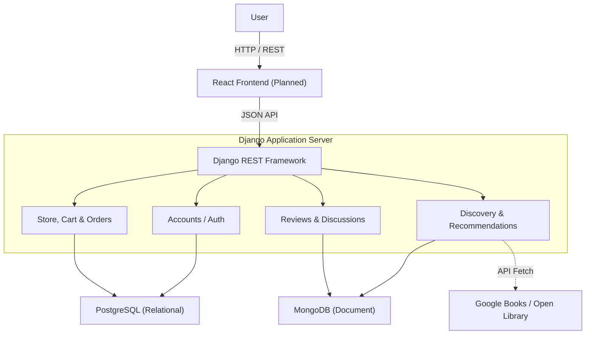
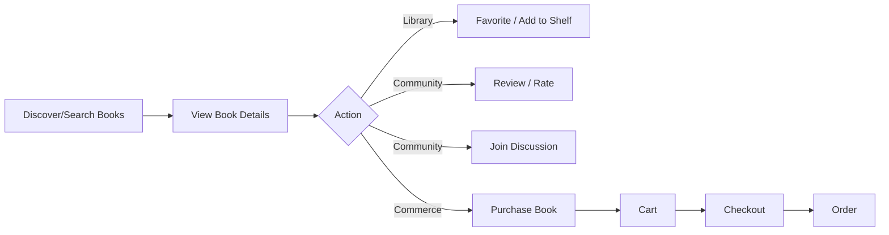
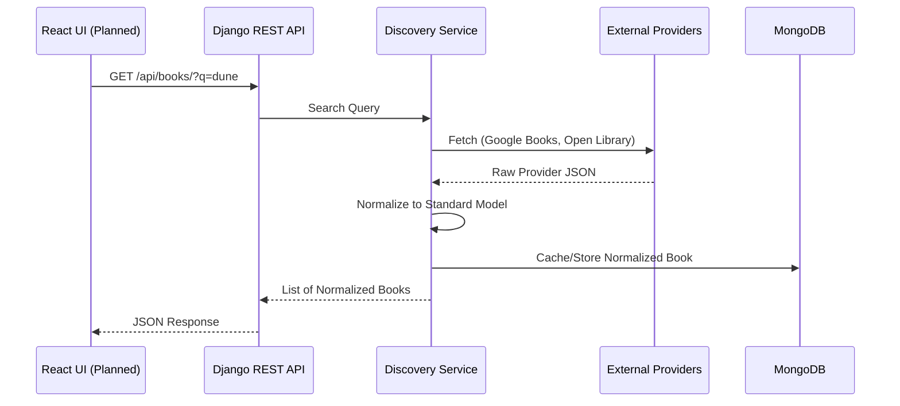
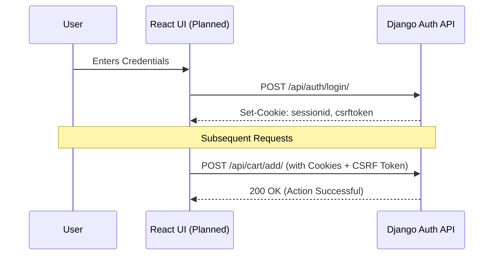
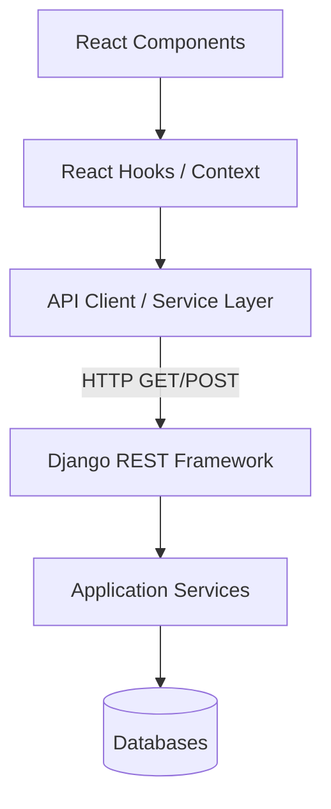

<div align="center">
  <h1>📚 Akashic Library</h1>
  <p><b>Unified Book Discovery, Community & Online Bookstore Platform</b></p>
  <p><i>Discover. Read. Connect. Shop.</i></p>
</div>

<div align="center">
  
  [](#)
  [](#)
  [](#)
  [](#)
  [](#)
  [-61DAFB.svg?logo=react&logoColor=white)](#)
  [](#)

</div>

<br />

## 🚧 Project Status

**Akashic Library is actively under development.** 
Currently, the **backend foundation is complete and fully tested.** The React frontend is the next major phase of development.

| Component | Status | Description |
| :--- | :---: | :--- |
| **Backend & API** | ✅ **Complete** | Django REST Framework API, Database models, Authentication, Core Services. |
| **Test Coverage** | ✅ **Passing** | 341/341 automated backend tests passing successfully (Verified). |
| **Integrations** | ✅ **Complete** | External book data providers (Google Books / Open Library) integrated. |
| **Frontend (React)** | ⏳ **Planned** | React/Vite Single Page Application integration pending. |

---

## 📖 What is Akashic Library?

Traditional book platforms often fracture the reading experience. You might discover a book on one site, track your reading progress on another, discuss it on a forum, and purchase it from a separate digital storefront. 

**Akashic Library** aims to bring these disjointed experiences together into a single, cohesive platform. It is designed from the ground up to unify **book discovery, personal library organization, community interaction, and digital commerce.**

### Core Features

#### 📚 Discovery
- Search books via unified external providers (Google Books, Open Library)
- Detailed book metadata and normalization
- Seamless source attribution

#### 👤 Identity
- Secure Registration and Login/Logout
- Session-based authentication (JWT-free by design)
- Role-aware access control

#### ⭐ Personal Library
- Save books to Favorites
- Manage reading progress via custom Shelves

#### 💬 Community
- Rate and review books
- Join and create community discussions
- Platform moderation capabilities

#### 🛒 Store
- Browse physical/digital store products
- Manage shopping cart
- Secure checkout and order processing

#### 🛡️ Administration
- Advanced administrative capabilities
- Role-based moderation and management

*(Note: The above features represent the complete backend API implementation. The graphical UI for these features is planned for the upcoming frontend phase.)*

---

## 🏗️ Architecture Diagram

The system employs a **polyglot persistence architecture**, separating relational identity and commerce data from document-based discovery and community data.



*Note: React communicates exclusively with the Django REST API. It never connects directly to PostgreSQL or MongoDB.*

---

## 🔄 System Workflow



---

## 🔍 Book Discovery Data Flow

To provide a seamless experience, Akashic Library normalizes data from multiple external providers before serving it to the client.



---

## 🔐 Authentication Flow



---

## 🌐 Frontend ↔ Backend Integration Strategy



*The frontend relies on centralized service/API abstractions rather than directly constructing database requests or API calls within UI components.*

---

## 📁 Project Structure

### Current Backend Structure
```text
Akashic_Library/
├── Akashic_Library/      # Core settings and URL routing
├── accounts/             # Identity, Users, Roles, Auth
├── discovery/            # Book search, normalization, APIs
├── store/                # E-commerce product management
├── cart/                 # Shopping cart sessions
├── orders/               # Checkout and order processing
├── community/            # Discussions and moderation
├── recommendations/      # Personalized book suggestions
├── requirements.txt      # Python dependencies
└── manage.py             # Django CLI
```

### Intended Frontend Structure (Upcoming Phase)
```text
frontend/
├── public/
├── src/
│   ├── assets/
│   ├── components/
│   ├── pages/
│   ├── layouts/
│   ├── hooks/
│   ├── context/
│   ├── services/       # Centralized API clients
│   ├── routes/
│   ├── App.jsx
│   └── main.jsx
├── .env.example
├── package.json
└── vite.config.js
```

---

## 🔌 API Documentation

The backend currently exposes the following key API foundations. 
*(Full reference available in `docs/API_REFERENCE.md`)*

| Method | Endpoint | Purpose | Auth Required |
| :--- | :--- | :--- | :---: |
| `GET` | `/api/health/` | System health check | ❌ |
| `POST` | `/api/auth/login/` | Establish user session | ❌ |
| `POST` | `/api/auth/logout/` | Destroy user session | ✅ |
| `GET` | `/api/books/` | Search across external providers | ❌ |
| `GET` | `/api/books/<id>/` | Get normalized book details | ❌ |
| `GET` | `/api/store/` | List store products | ❌ |
| `GET` | `/api/cart/` | View current shopping cart | ✅ |
| `POST` | `/api/orders/checkout/` | Process cart into an order | ✅ |
| `GET` | `/api/community/` | List community discussions | ❌ |
| `GET` | `/api/recommendations/`| List personalized book suggestions | ✅ |

---

## ⚙️ Backend Architecture

The backend is built with **Django 6.1.1** and **Django REST Framework (DRF) 3.18.1**. 

Key technical implementations include:
- **Custom User Model**: UUID-based identity with robust session authentication.
- **Polyglot Persistence**: 
  - PostgreSQL for transactional reliability (Accounts, Orders).
  - MongoDB for flexible document storage (Books, Reviews, Discussions).
- **Service Layer Pattern**: Business logic is decoupled from views/serializers.
- **Provider Adapters**: Extensible adapter pattern for integrating external APIs (Google Books, Open Library).
- **Robust Testing**: Comprehensive unit and integration tests using in-memory databases (`sqlite3` and `mongomock`).

---

## 🧪 Testing

The backend maintains strict test coverage, verifying domain logic, API contracts, and database interactions.

**Current Verified Status:**
- **341 / 341 tests passing** ✅
- `0 issues` reported by Django check.
- `No changes detected` by migrations check.

```bash
python manage.py test --settings=Akashic_Library.test_settings
```
*(Tests utilize an in-memory SQLite database and `mongomock` for rapid execution without external infrastructure dependencies.)*

---

## 🚀 Getting Started (Development Setup)

### Prerequisites
- **Python** 3.14.x
- **PostgreSQL** 14+
- **MongoDB** 6.0+
- **Git**
- *(Node.js 18+ will be required for the future frontend)*

### 1. Clone & Setup Virtual Environment
```bash
git clone git@github.com:ragnarStark79/Akashic-Library.git
cd Akashic-Library/Akashic_Library

python -m venv venv
source venv/bin/activate
pip install -r requirements.txt
```

### 2. Environment Configuration
**Never commit secrets to version control.**
```bash
cp .env.example .env
```
Edit `.env` and configure your local `DJANGO_SECRET_KEY`, database credentials, and optional API keys.

### 3. Database Migration
```bash
python manage.py migrate
```

### 4. Run the Development Server
```bash
python manage.py runserver
```
The API will be available at `http://localhost:8000/api/`.

---

## 🛠️ Configuration & Environment

Sensitive configuration is driven entirely by environment variables via `.env`.

**Key Variables:**
- `DJANGO_SECRET_KEY`
- `DJANGO_DEBUG`
- `POSTGRES_DB` / `POSTGRES_USER` / `POSTGRES_PASSWORD`
- `MONGODB_URI` / `MONGODB_NAME`
- `CORS_ALLOWED_ORIGINS`

For the future React frontend, configuration will be handled via `VITE_API_BASE_URL`.

---

## 🎨 Design & UI Vision (Upcoming Phase)

The upcoming React SPA will be designed with the following principles:
- **Book-Centric Visual Hierarchy**: Highlighting cover art, typography, and readability.
- **Search-First Experience**: Frictionless discovery and exploration.
- **Responsive Layouts**: Seamless experience across mobile, tablet, and desktop.
- **Accessible Components**: Adhering to ARIA standards and keyboard navigability.
- **Graceful States**: Polished loading skeletons, empty states, and error handling.

---

## 🗺️ Development Roadmap

### ✅ Completed
- [x] Django backend foundation
- [x] Custom accounts & session identity
- [x] Polyglot data architecture (PostgreSQL + MongoDB)
- [x] Discovery layer & provider integration
- [x] Community, reviews, and moderation APIs
- [x] Commerce, cart, and checkout APIs
- [x] Automated backend test suite (341 tests passing)

### ⏳ In Progress / Next
- [ ] React/Vite frontend foundation
- [ ] Frontend routing & layout design
- [ ] API client/service integration
- [ ] Authentication and User Profile UI
- [ ] Book discovery and search UI

### 📅 Planned
- [ ] Reviews and Community UI
- [ ] Shopping Cart and Checkout UI
- [ ] Administrative Moderation Dashboard
- [ ] End-to-End Testing (Cypress/Playwright)
- [ ] Production Deployment Strategy

---

## 🤝 Collaboration & Contribution Workflow

This repository utilizes branch protection. **Direct pushes to `main` are prohibited.**

### Workflow
1. **Clone** the repository.
2. **Branch** off `main` for your work.
3. **Commit** using the convention below.
4. **Push** your branch to GitHub.
5. **Open a Pull Request** against `main`.
6. **Merge** only after code review and CI checks pass.

```bash
git checkout main
git pull origin main
git checkout -b feature/your-feature-name

# Make your changes...
git add .
git commit -m "feat: add awesome new functionality"
git push -u origin feature/your-feature-name
```

### Branch Naming Convention
- `feature/<feature-name>`
- `fix/<bug-name>`
- `refactor/<area>`
- `docs/<documentation-change>`
- `test/<testing-change>`
- `chore/<maintenance-task>`

### Commit Convention
- `feat:` for new features.
- `fix:` for bug fixes.
- `docs:` for documentation updates.
- `refactor:` for code refactoring without behavior changes.
- `test:` for adding or updating tests.
- `chore:` for maintenance, dependencies, or tooling.

---

## 🔒 Security Notes

- **Never** commit `.env` files or expose credentials.
- **Backend Responsibility**: Authentication, authorization, and sensitive business logic strictly remain on the Django backend.
- Do not place backend secrets in React environment variables (`VITE_`).
- All external API communication happens Server-to-Server to protect API keys.

---

## 🎓 Academic / Project Context

This platform is developed as a comprehensive academic final-year/semester project demonstrating full-stack engineering, polyglot persistence, software architecture patterns, and API design.

---
<div align="center">
  <p><i>Akashic Library — Expanding the digital reading experience.</i></p>
</div>
