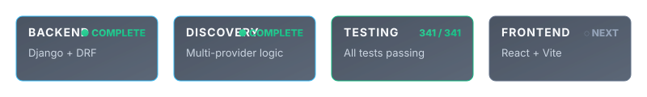
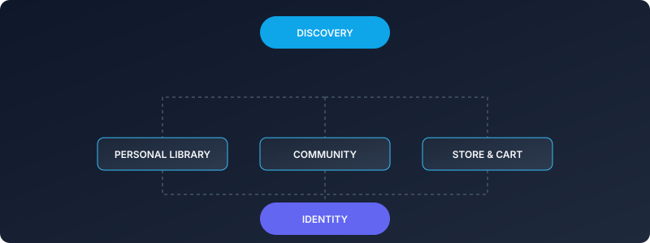
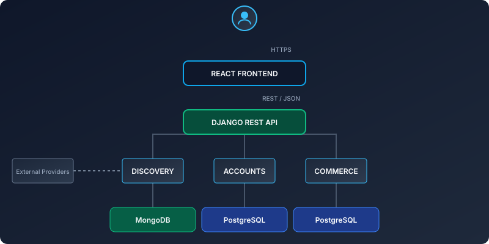
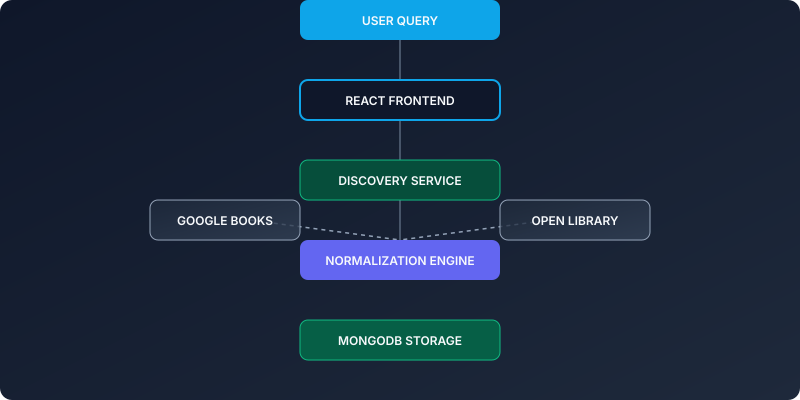
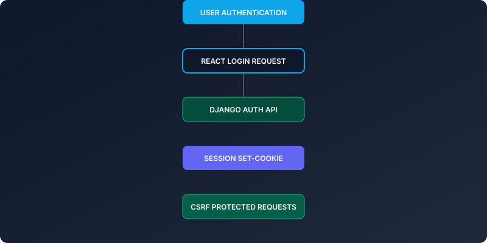
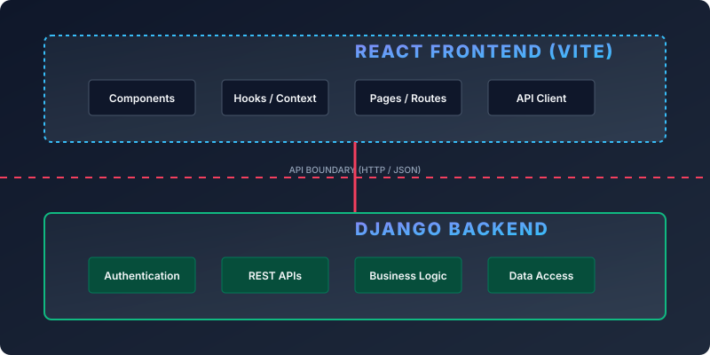
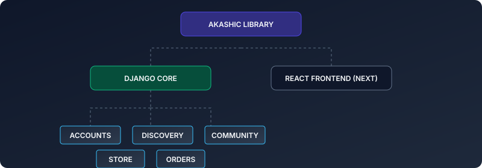
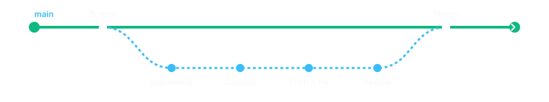

<div align="center">
  
</div>

<div align="center">
  <br />
  [](#)
  [](#)
  [](#)
  [](#)
  [](#)
  [-61DAFB.svg?logo=react&logoColor=white)](#)
</div>

<br />

<div align="center">
  
</div>

<br />

## 📖 The Idea

Traditional book platforms fracture the reading experience. You discover a book on one site, track your reading progress on another, discuss it on a forum, and purchase it from a separate digital storefront. 

**Akashic Library** brings these disjointed experiences together. It is built from the ground up to unify **book discovery, personal library organization, community interaction, and digital commerce.**

<br />

## 🌌 Feature Ecosystem

<div align="center">
  
</div>

<br />

<details>
<summary><b>View Feature Details</b></summary>
<br />

- **Discovery:** Search books via unified external providers (Google Books, Open Library). Detailed metadata and seamless source attribution.
- **Identity:** Secure Registration and Login. Session-based authentication (JWT-free) with role-aware access control.
- **Personal Library:** Save books to Favorites. Manage reading progress via custom Shelves.
- **Community:** Rate and review books. Join and create community discussions. Moderation capabilities.
- **Store & Cart:** Browse physical/digital store products, manage shopping cart, secure checkout and order processing.
</details>

<br />

## 🏗️ System Architecture

The system employs a **polyglot persistence architecture**, separating relational identity and commerce data from document-based discovery and community data.

<div align="center">
  
</div>

<br />

## 🔍 Discovery Flow

Akashic Library normalizes data from multiple external providers (Google Books, Open Library) before serving it to the client, providing a seamless "many sources → one experience" flow.

<div align="center">
  
</div>

<br />

## 🔐 Authentication Flow

We utilize robust, secure Session Authentication.

<div align="center">
  
</div>

<br />

## 🌐 Frontend ↔ Backend Boundary

The system cleanly separates the React Single Page Application from the Django backend. React communicates exclusively with the Django REST API. It never connects directly to PostgreSQL or MongoDB.

<div align="center">
  
</div>

<br />

## 📁 Project Map

<div align="center">
  
</div>

<br />

<details>
<summary><b>View Technical Directory Structure</b></summary>
<br />

```text
Akashic_Library/
├── Akashic_Library/      # Core settings and URL routing
├── accounts/             # Identity, Users, Roles, Auth
├── discovery/            # Book search, normalization, APIs
├── store/                # E-commerce product management
├── cart/                 # Shopping cart sessions
├── orders/               # Checkout and order processing
├── community/            # Discussions and moderation
├── recommendations/      # Personalized book suggestions
├── requirements.txt      # Python dependencies
└── manage.py             # Django CLI
```
</details>

<br />

## 🔌 API Gateway

<div align="center">
  <p><code>React Component ➔ HTTP/JSON ➔ Django REST Framework API</code></p>
</div>

The backend exposes the following key API foundations. 
*(Full reference available in `docs/API_REFERENCE.md`)*

| Method | Endpoint | Purpose | Auth Required |
| :--- | :--- | :--- | :---: |
| `GET` | `/api/health/` | System health check | ❌ |
| `POST` | `/api/auth/login/` | Establish user session | ❌ |
| `GET` | `/api/books/` | Search across external providers | ❌ |
| `GET` | `/api/books/<id>/` | Get normalized book details | ❌ |
| `GET` | `/api/store/` | List store products | ❌ |
| `GET` | `/api/cart/` | View current shopping cart | ✅ |
| `POST` | `/api/orders/checkout/` | Process cart into an order | ✅ |
| `GET` | `/api/community/` | List community discussions | ❌ |
| `GET` | `/api/recommendations/`| List personalized book suggestions | ✅ |

<br />

## ⚙️ Tech Stack & Architecture

- **Django 6.1.1** & **Django REST Framework (DRF) 3.18.1**. 
- **Custom User Model**: UUID-based identity with session authentication.
- **Polyglot Persistence**: 
  - **PostgreSQL** for transactional reliability (Accounts, Orders).
  - **MongoDB** for flexible document storage (Books, Reviews, Discussions).
- **Service Layer Pattern**: Business logic decoupled from views/serializers.
- **Provider Adapters**: Extensible adapter pattern for integrating Google Books and Open Library.

<br />

## 🧪 Testing

<div align="center">
  
</div>

The backend maintains strict test coverage, verifying domain logic, API contracts, and database interactions.

```bash
python manage.py test --settings=Akashic_Library.test_settings
```

<br />

## 🚀 Development Setup

### 1. Prerequisites & Environment
Ensure you have **Python 3.14.x**, **PostgreSQL 14+**, and **MongoDB 6.0+**.

```bash
git clone git@github.com:ragnarStark79/Akashic-Library.git
cd Akashic-Library/Akashic_Library
python -m venv venv
source venv/bin/activate
pip install -r requirements.txt
cp .env.example .env
```
*Configure `.env` with your local database credentials.*

### 2. Database & Server
```bash
python manage.py migrate
python manage.py runserver
```

<br />

## 🗺️ Development Roadmap

<div align="center">
  
</div>

<br />

<details>
<summary><b>View Roadmap Details</b></summary>
<br />

### ✅ Completed
- Django backend foundation
- Custom accounts & session identity
- Polyglot data architecture (PostgreSQL + MongoDB)
- Discovery layer & provider integration
- Community, reviews, and moderation APIs
- Commerce, cart, and checkout APIs
- Automated backend test suite (341 tests passing)

### ◉ In Progress / Next
- React/Vite frontend foundation
- Frontend routing & layout design
- API client/service integration

### ○ Planned
- Reviews and Community UI
- Shopping Cart and Checkout UI
- Production Deployment Strategy
</details>

<br />

## 🤝 Collaboration & Git Workflow

This repository utilizes branch protection. **Direct pushes to `main` are prohibited.**

<div align="center">
  
</div>

```bash
git checkout main
git pull origin main
git checkout -b feature/your-feature-name

# Make changes
git commit -m "feat: add feature"
git push -u origin feature/your-feature-name
```

<br />

## 🔒 Security

- **Never** commit `.env` files or expose credentials.
- **Backend Responsibility**: Authentication, authorization, and sensitive business logic strictly remain on the Django backend.
- Do not place backend secrets in React environment variables (`VITE_`).
- All external API communication happens Server-to-Server to protect API keys.

<br />

## 🎓 Academic Context

This platform is developed as a comprehensive academic final-year/semester project demonstrating full-stack engineering, polyglot persistence, software architecture patterns, and API design.
